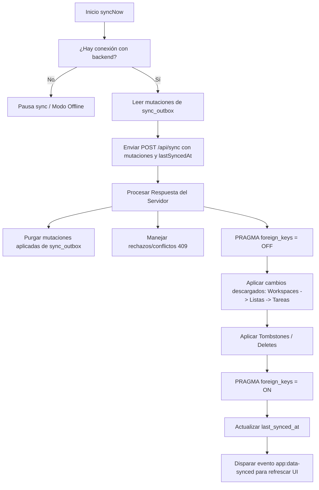

# Web-Offline Client (Frontend SPA)

Frontend de alto rendimiento construido con **React 19**, **TypeScript**, **Vite 8**, **Tailwind CSS** y **SQLite Wasm con OPFS**. Diseñado bajo principios rigurosos de **Local-First / Offline-First**: todas las lecturas y modificaciones del usuario se completan de forma instantánea contra la base de datos local embebida antes de cualquier comunicación de red.

---

## 🏛️ Arquitectura del Cliente

```
client/
├── public/
│   ├── apple-touch-icon.png         # Ícono para iOS Safari (180x180)
│   ├── favicon-64x64.png / .ico / .svg # Favicons de alta fidelidad
│   ├── pwa-192x192.png / pwa-512x512.png # Íconos PWA adaptativos
│   ├── sqlite3.wasm                 # Binario oficial de SQLite compilado a WebAssembly (~868 KB)
│   └── sqlite3-opfs-async-proxy.js  # Proxy asíncrono para Storage Access Handle Pool (SAHPool)
│
├── src/
│   ├── components/
│   │   ├── layout/
│   │   │   └── AppLayout.tsx        # Layout con barra de navegación, monitores y botón PWA
│   │   └── modals/
│   │       ├── CsvImportModal.tsx   # Importador inteligente de tareas con auto-mapeo
│   │       ├── ModalRoot.tsx        # Administrador centralizado de modales vía URL params
│   │       ├── NewTaskModal.tsx     # Creación de tareas con soporte para "Tareas sin lista"
│   │       ├── NewWorkspaceModal.tsx # Creación de nuevos espacios de trabajo
│   │       ├── SessionManagerModal.tsx # Gestión de sesiones offline y persistencia
│   │       └── TaskDetailModal.tsx  # Vista detallada de tareas, subtareas y edición
│   │
│   ├── context/
│   │   ├── AuthContext.tsx          # Autenticación, persistencia de JWT y rotación de tokens
│   │   └── SyncContext.tsx          # Estado del motor de sincronización, polling y disparadores
│   │
│   ├── db/
│   │   ├── repositories/            # Acceso a datos tipado en SQLite
│   │   │   ├── listRepository.ts    # CRUD de listas con protección contra claves foráneas
│   │   │   ├── metaRepository.ts    # Metadatos del cliente (last_synced_at)
│   │   │   ├── outboxRepository.ts  # Cola de mutaciones salientes pendientes (Outbox Pattern)
│   │   │   ├── taskRepository.ts    # Tareas, subtareas, jerarquía, reglas y sanitización
│   │   │   └── workspaceRepository.ts # CRUD de espacios de trabajo
│   │   ├── schema.ts                # Esquema DDL en SQL y modelos de datos en TypeScript
│   │   ├── sqlite.worker.ts         # Dedicated Web Worker para ejecución no bloqueante de SQLite
│   │   └── sqliteClient.ts          # Cliente RPC asíncrono sobre el Web Worker
│   │
│   ├── hooks/
│   │   └── useUrlParams.ts          # Gestión reactiva de modales y filtros vía Query String
│   │
│   ├── pages/
│   │   ├── AdminAuditPage.tsx       # Trazabilidad empresarial: Changelog y HTTP Request Logs
│   │   ├── LoginPage.tsx            # Autenticación con soporte de credenciales persistentes
│   │   ├── WorkspaceDetailPage.tsx  # Tablero Kanban interactivo, jerarquías y filtros
│   │   └── WorkspacesPage.tsx       # Catálogo de espacios de trabajo y accesos rápidos
│   │
│   ├── services/
│   │   ├── apiClient.ts             # Cliente HTTP con intercepción y reintento con refresh token
│   │   ├── authStorage.ts           # Almacenamiento seguro de tokens y usuario en localStorage
│   │   ├── connectivity.ts          # Monitor reactivo de conectividad (Online / Offline / Server Unreachable)
│   │   └── syncEngine.ts            # Motor de sincronización Push/Pull por lotes
│   │
│   ├── App.tsx                      # Enrutamiento principal (React Router DOM v7)
│   ├── main.tsx                     # Inicialización del DOM y registro de Service Worker
│   └── vite-env.d.ts                # Declaraciones de tipos para PWA y variables de entorno
│
├── vite.config.ts                   # Configuración de Vite, cabeceras COOP/COEP y VitePWA
└── package.json
```

---

## 💾 Motor de Base de Datos: SQLite Wasm + OPFS

Para garantizar persistencia real, tolerancia a cierres de pestaña y rendimiento sin bloqueos en el hilo principal de la interfaz (UI Thread), la base de datos se ejecuta dentro de un **Dedicated Web Worker** (`sqlite.worker.ts`).

### Arquitectura de Almacenamiento Multi-Tier:
1. **Tier 1 — `OpfsSAHPoolDb` (Storage Access Handle Pool)**:
   - Utiliza la API moderna de Storage Access Handle Pool de la biblioteca oficial `@sqlite.org/sqlite-wasm`.
   - Asigna ficheros de acceso exclusivo en el OPFS del navegador, permitiendo escrituras y lecturas de alta velocidad sin bloqueos asíncronos.
   - Estado reportado en la UI: **`OPFS (SAHPool)`**.
2. **Tier 2 — `OpfsDb`**:
   - En caso de que el pool SAH no esté disponible, se degrada a la implementación estándar de OPFS (`vfs: opfs`).
   - Estado reportado en la UI: **`OPFS (Standard)`**.
3. **Tier 3 — Memoria (`jsstorage` / In-Memory)**:
   - Si el navegador o entorno no soporta OPFS (o navegación privada restrictiva), se activa una base de datos volátil en memoria.
   - Estado reportado en la UI: **`Virtual (No OPFS)`** con alertas preventivas.

### Cabeceras de Seguridad Requeridas (COOP / COEP):
Para que los navegadores habiliten `SharedArrayBuffer` y las APIs de acceso a archivos sincrónicas en Workers, el servidor Vite inyecta las siguientes cabeceras en todas las respuestas:
```http
Cross-Origin-Opener-Policy: same-origin
Cross-Origin-Embedder-Policy: require-corp
```

---

## 🗄️ Esquema Local de la Base de Datos

Definido en `client/src/db/schema.ts`:

- **`workspaces`**: Espacios de trabajo locales con control de versión y estado de borrado (`is_deleted`).
- **`workspace_members`**: Vínculos de membresía y roles (`Editor`, `Viewer`, `Admin`).
- **`lists`**: Listas o columnas Kanban asociadas a un workspace.
- **`tasks`**: Tareas y subtareas. Incluye:
  - `list_id`: Referencia a `lists(id)` o `null` si pertenece a "Tareas sin lista".
  - `parent_task_id`: Referencia a `tasks(id)` para subtareas recursivas.
  - `version`: Contador numérico para Concurrencia Optimista (OCC).
  - `is_deleted`: Bandera de borrado lógico (tombstone).
- **`sync_outbox`**: Cola de mutaciones salientes pendientes de enviar al backend.
- **`sync_meta`**: Clave-valor de configuración local (incluye `last_synced_at`).

---

## 🔄 Motor de Sincronización (`syncEngine.ts`)

El motor de sincronización se ejecuta periódicamente cada 30 segundos (cuando hay conexión) y también ante cualquier acción manual o reconexión de red:



### Prevención de Conflictos y Errores de Clave:
- **`ON CONFLICT(id) DO UPDATE`**: Todas las inserciones locales aplican actualización in-place si el ID ya existía (por ejemplo, si la entidad estaba marcada como `is_deleted = 1`).
- **Saneamiento de Huérfanos**: Si una tarea hace referencia a un `list_id` que fue eliminado, el repositorio la reubica automáticamente a `list_id = null` (**Tareas sin lista**), impidiendo que el motor falle con violaciones de clave foránea (`SQLITE_CONSTRAINT_FOREIGNKEY 787`).
- **Aislamiento de Eco**: Al aplicar cambios descargados del servidor, las operaciones se marcan como `isSync = true`, evitando que generen nuevas mutaciones en el `sync_outbox`.

---

## 📦 Progressive Web App (PWA)

El cliente está configurado con **`vite-plugin-pwa`** y **Workbox**:

1. **Precacheo Offline**:
   - Todo el bundle HTML, CSS, JavaScript, WebAssembly (`sqlite3.wasm`) y assets estáticos se precachean en la instalación del Service Worker.
   - La aplicación carga de forma instantánea sin necesidad de red.
2. **Instalación Asistida**:
   - `AppLayout.tsx` intercepta el evento nativo del navegador `beforeinstallprompt`.
   - Presenta un botón interactivo **"Instalar App"** con degradado azul en el encabezado.
   - Al completarse la instalación, se muestra el estado **"PWA Activa"**.
3. **Soporte de Desarrollo (`devOptions.enabled = true`)**:
   - Permite depurar el Service Worker y el manifiesto directamente en `http://localhost:5173`.

---

## 💻 Comandos de Desarrollo

```bash
# Instalar dependencias
npm install

# Iniciar servidor de desarrollo con HMR
npm run dev

# Compilar TypeScript y construir bundle para producción
npm run build

# Previsualizar el bundle compilado localmente
npm run preview
```
